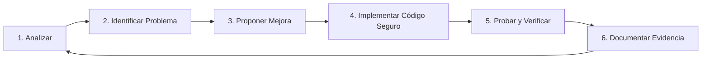

# 🛡️ PNKSecurity Web Application

> **Caso de Estudio Práctico — Asignatura CI3064: Desarrollo Seguro**  
> *Área de Tecnologías de Información y Ciberseguridad — INACAP*

[](https://www.php.net/)
[](https://www.mysql.com/)
[](https://getbootstrap.com/)
[](#)
[](#)
[](#)

---

## 📋 Tabla de Contenidos

- [1. Descripción del Proyecto](#1-descripción-del-proyecto)
- [2. Contexto Académico y Objetivos](#2-contexto-académico-y-objetivos)
- [3. Arquitectura y Stack Tecnológico](#3-arquitectura-y-stack-tecnológico)
- [4. Estructura del Repositorio](#4-estructura-del-repositorio)
- [5. Requisitos Previos](#5-requisitos-previos)
- [6. Instalación y Puesta en Marcha](#6-instalación-y-puesta-en-marcha)
- [7. Credenciales y Datos de Prueba](#7-credenciales-y-datos-de-prueba)
- [8. Metodología de Trabajo DevSecOps](#8-metodología-de-trabajo-devsecops)
- [9. Matriz de Áreas de Seguridad (Línea Base)](#9-matriz-de-áreas-de-seguridad-línea-base)
- [10. Políticas de Seguridad del Repositorio](#10-políticas-de-seguridad-del-repositorio)
- [11. Lineamientos sobre el Uso de Inteligencia Artificial](#11-lineamientos-sobre-el-uso-de-inteligencia-artificial)
- [12. Declaración Ética y de Responsabilidad](#12-declaración-ética-y-de-responsabilidad)
- [13. Equipo de Trabajo y Control de Versiones](#13-equipo-de-trabajo-y-control-de-versiones)

---

## 1. Descripción del Proyecto

**PNKSecurity** es una aplicación web de catálogo gastronómico y pedidos para restobares desarrollada originalmente con fines didácticos en PHP y MySQL. El sistema permite a los clientes consultar cartas digitales organizadas por categorías, seleccionar productos para un carrito de compras y publicar comentarios de retroalimentación, mientras que el personal administrativo gestiona el acceso mediante autenticación.

En el marco del curso, esta aplicación constituye el **caso de estudio práctico** para identificar malas prácticas de codificación, detectar fallas arquitectónicas y de seguridad, e implementar progresivamente controles de mitigación y defensa en profundidad.

---

## 2. Contexto Académico y Objetivos

### 🎓 Asignatura: CI3064 — Desarrollo Seguro

- **Unidad 1 — Perspectiva DevSecOps:** Análisis del sistema, modelado de amenazas, auditoría inicial e identificación de riesgos y oportunidades de mejora.
- **Unidad 2 — Desarrollo y Pruebas de Software Seguro:** Intervención directa sobre el código fuente, establecimiento de ambiente controlado, refactorización segura y verificación mediante pruebas de seguridad.

### 🎯 Objetivos de Aprendizaje

1. **Comprender el Ciclo de Vida de Desarrollo Seguro (SSDLC):** Aplicar controles de seguridad desde la fase de diseño hasta el despliegue.
2. **Aplicar la Norma ISO/IEC 27034:** Incorporar procesos de seguridad en aplicaciones a través de Controles de Seguridad de la Aplicación (ASC).
3. **Validación y Sanitización de Entradas:** Erradicar fallas de inyección (SQL Injection, Cross-Site Scripting).
4. **Protección de Datos Sensibles y Criptografía:** Evitar el almacenamiento en texto claro de contraseñas y datos del negocio.
5. **Gestión Robusta de Sesiones y Cookies:** Implementar atributos seguros (`HttpOnly`, `Secure`, `SameSite`), regeneración de identificadores y expiración adecuada.
6. **Evidencia y Trazabilidad:** Documentar cada vulnerabilidad resuelta mediante pruebas unitarias/funcionales y registros de cambios verificables.

---

## 3. Arquitectura y Stack Tecnológico

| Capa | Tecnología / Herramienta | Detalle |
| :--- | :--- | :--- |
| **Backend** | PHP 7.4+ / 8.x | Extensiones `mysqli`, `session`, `json` |
| **Base de Datos** | MySQL 8.0+ / MariaDB 10.4+ | Motor InnoDB, UTF-8 Spanish (`utf8_spanish_ci`) |
| **Servidor Web** | Apache HTTP Server / Nginx | Soporte para reescritura de URLs y headers HTTP |
| **Frontend** | HTML5, CSS3, JavaScript (ES6) | Responsive Design |
| **Librerías UI** | Bootstrap 4.x, jQuery 3.2.1 | Themify Icons, Owl Carousel, Nice Select, Magnific Popup |
| **Gestión y Control**| Git / GitHub | Flujo de ramas, revisiones y trazabilidad de commits |

---

## 4. Estructura del Repositorio

A continuación se detalla la distribución de archivos y la responsabilidad funcional de cada directorio del proyecto:

```plaintext
pnkSecurityWeb/
├── .gitignore               # Exclusión de archivos temporales, logs y configuraciones IDE
├── README.md                # Documentación integral del proyecto
├── index.php                # Vista principal de la carta del restaurante (recibe parámetro ?id=)
├── info.php                 # Reconocimiento del entorno (phpinfo - auditoría requerida)
├── carrito.php              # Controlador de operaciones del carrito (agregar, remover, vaciar)
├── mostrar_carrito.php      # Vista y resumen de ítems agregados al pedido
├── grcomentarios.php        # Procesamiento y guardado de comentarios de usuarios
├── setup/
│   ├── setup.php            # Configuración de conexión a base de datos y utilidades auxiliares
│   ├── procesalogin.php     # Controlador de autenticación de usuarios
│   └── cerrar_sesion.php    # Finalización y destrucción de la sesión activa
├── Script_BD/
│   └── pnk_security.sql     # Script DDL/DML de estructura y datos iniciales de la base de datos
├── css/                     # Hojas de estilo personalizadas (style.css)
├── js/                      # Lógica JavaScript y controladores AJAX del cliente
├── imagenes/                # Fotografías de cartas e ítems organizadas por código de restaurante
├── img/                     # Recursos gráficos generales y banners del sitio
└── vendors/                 # Dependencias externas de diseño y comportamiento (Bootstrap, plugins)
```

---

## 5. Requisitos Previos

Antes de configurar la aplicación, asegúrese de contar con:

- **Servidor Web Local:** [XAMPP](https://www.apachefriends.org/), [Laragon](https://laragon.org/), [WampServer](https://www.wampserver.com/) o un stack nativo Linux/macOS (**Apache + PHP + MySQL**).
- **PHP:** Versión `7.4` o superior (compatible con PHP 8.x, verificando funciones deprecadas).
- **Servidor MySQL/MariaDB:** Puerto estándar `3306`.
- **Git:** Versión actualizada para el control de versiones.
- **Navegador Web:** Chrome, Firefox, Edge o Brave con herramientas para desarrolladores.
- **Herramientas de Auditoría (Opcionales / Laboratorio):** OWASP ZAP, Burp Suite Community, Postman.

---

## 6. Instalación y Puesta en Marcha

Siga estos pasos para desplegar el ambiente de ejecución local controlado:

### Paso 1: Clonar el Repositorio

Clone este repositorio en el directorio raíz de documentos de su servidor web (por ejemplo, `htdocs` en XAMPP o `/var/www/html` en Linux):

```bash
cd /opt/lampp/htdocs  # O C:\xampp\htdocs en Windows
git clone https://github.com/imVic-byte/DesarrolloSeguro.git pnkSecurityWeb
cd pnkSecurityWeb
```

### Paso 2: Crear e Importar la Base de Datos

1. Inicie los servicios de **Apache** y **MySQL**.
2. Abra su cliente de base de datos preferido (phpMyAdmin, MySQL Workbench, DBeaver o terminal).
3. Cree la base de datos `pnk_security`:

```sql

sudo mysql -e "CREATE DATABASE IF NOT EXISTS pnk_security; ALTER USER 'root'@'localhost' IDENTIFIED WITH mysql_native_password BY ''; FLUSH PRIVILEGES;"
```

4. Importe el archivo de esquema y datos disponible en [Script_BD/pnk_security.sql](file:///mnt/c/Users/drixt/DesarrolloSeguro/pnkSecurityWeb/Script_BD/pnk_security.sql):

```bash
# Vía CLI:
mysql -u root -p pnk_security < Script_BD/pnk_security.sql
```

### Paso 3: Configurar la Conexión a la Base de Datos

Revise el archivo [`setup/setup.php`](file:///mnt/c/Users/drixt/DesarrolloSeguro/pnkSecurityWeb/setup/setup.php). Verifique que los parámetros coincidan con su entorno local:

```php
function conectar()
{
    $host = "localhost";
    $user = "root";
    $pass = ""; // Coloque la contraseña de su MySQL local si aplica
    $db   = "pnk_security";
    
    $con = mysqli_connect($host, $user, $pass, $db);
    return $con;
}
```

> [!TIP]
> Como buena práctica de desarrollo seguro, en etapas posteriores se recomienda migrar estas credenciales a variables de entorno (`.env`) o archivos de configuración fuera del árbol público.

### Paso 4: Ejecutar la Aplicación

Abra su navegador e ingrese a la dirección base indicando el identificador del restaurante:

```text
http://localhost/pnkSecurityWeb/index.php?id=1
```

*(El parámetro `?id=1` carga los menús correspondientes a "África Restobar". Pruebe con IDs válidos como 1, 2 o 3 según los registros de la base de datos).*

---

## 7. Credenciales y Datos de Prueba

El script de base de datos inicial incluye cuentas precargadas destinadas a pruebas en laboratorio:

| Usuario (Email) | Contraseña Inicial | Rol / Permisos | Estado |
| :--- | :--- | :--- | :--- |
| `admin@gmail.com` | `admin01` | Administrador | Activo (`1`) |
| `alondra@gmail.com` | `alondra01` | Cliente / Usuario | Activo (`1`) |

> [!CAUTION]
> **Alerta de Seguridad:** Las contraseñas en la versión base están almacenadas en texto claro sin salting ni función de hashing (MD5/SHA/bcrypt inexistente). Una de las tareas prioritarias del equipo es implementar hashing robusto (`password_hash` con `PASSWORD_BCRYPT` o `PASSWORD_ARGON2ID`).

---

## 8. Metodología de Trabajo DevSecOps

Para asegurar trazabilidad técnica y coherencia académica, todas las modificaciones al código deben regirse por el siguiente ciclo iterativo:



### Flujo de Trabajo en Git

1. **Línea Base:** Mantener una rama intacta con el estado vulnerable original para efectos de comparación y demostración.
2. **Feature/Fix Branches:** Trabajar mejoras puntuales en ramas temáticas (ej: `fix/sql-injection-login`, `feat/password-hashing`, `sec/session-hardening`).
3. **Commits Semánticos:** Describir con precisión qué debilidad se soluciona (ej: `fix(auth): sanitizar parametros y usar sentencias preparadas en login`).
4. **Validación Doble:** Cada cambio debe ser probado tanto desde el punto de vista funcional (que el negocio siga operando) como de seguridad (que el vector de ataque sea neutralizado).

---

## 9. Matriz de Áreas de Seguridad (Línea Base)

A partir del análisis inicial de la Unidad 1 y el código fuente base, se identifican los siguientes vectores para la Unidad 2:

| Componente | Vulnerabilidad / Vector | Riesgo (OWASP Top 10) | Acción de Hardening Recomendada |
| :--- | :--- | :--- | :--- |
| [`setup/procesalogin.php`](file:///mnt/c/Users/drixt/DesarrolloSeguro/pnkSecurityWeb/setup/procesalogin.php) | Inyección SQL directa en variables POST sin sanitizar | **A03:2021 - Injection** | Sentencias preparadas con `mysqli_prepare` o PDO |
| [`setup/procesalogin.php`](file:///mnt/c/Users/drixt/DesarrolloSeguro/pnkSecurityWeb/setup/procesalogin.php) | Comparación de contraseñas en texto claro | **A07:2021 - Identification & Auth Failures** | Uso de `password_verify()` y algoritmo Bcrypt |
| [`grcomentarios.php`](file:///mnt/c/Users/drixt/DesarrolloSeguro/pnkSecurityWeb/grcomentarios.php) & [`index.php`](file:///mnt/c/Users/drixt/DesarrolloSeguro/pnkSecurityWeb/index.php) | Inserción y renderizado de comentarios sin sanitizar (XSS Almacenado) | **A03:2021 - Injection** | Sanitización y escape contextual con `htmlspecialchars()` |
| [`index.php`](file:///mnt/c/Users/drixt/DesarrolloSeguro/pnkSecurityWeb/index.php) & [`mostrar_carrito.php`](file:///mnt/c/Users/drixt/DesarrolloSeguro/pnkSecurityWeb/mostrar_carrito.php) | Manipulación de parámetros GET sin validación de tipo numérico (`?id=`) | **A01:2021 - Broken Access Control** / Injection | Validación de enteros con `filter_input()` o casting estricto |
| [`setup/setup.php`](file:///mnt/c/Users/drixt/DesarrolloSeguro/pnkSecurityWeb/setup/setup.php) | Credenciales de base de datos incrustadas en código duro (*Hardcoded*) | **A05:2021 - Security Misconfiguration** | Extracción a variables de entorno protegidas |
| Sesiones PHP | Cookies de sesión sin flags `HttpOnly`, `Secure` ni `SameSite` | **A07:2021 - Identification & Auth Failures** | Configurar directivas en `php.ini` o `session_set_cookie_params()` |
| [`info.php`](file:///mnt/c/Users/drixt/DesarrolloSeguro/pnkSecurityWeb/info.php) | Exposición completa de configuración del servidor (`phpinfo`) | **A05:2021 - Security Misconfiguration** | Eliminación del script o restricción de acceso estricta |

---

## 10. Políticas de Seguridad del Repositorio

> [!IMPORTANT]
> **Normas Obligatorias sobre Datos Sensibles:**
> - **Cero Secretos:** Bajo ninguna circunstancia se deben subir contraseñas de producción, tokens personales de GitHub, llaves API institucionales o certificados privados.
> - **Datos Ficticios:** Utilizar exclusivamente datos de prueba y perfiles ficticios en la base de datos.
> - **Revisión antes de Commit:** Verificar con `git diff --staged` antes de realizar cada confirmación para evitar la filtración accidental de configuraciones locales.

---

## 11. Lineamientos sobre el Uso de Inteligencia Artificial

De acuerdo con las directrices académicas de la asignatura:

- Se permite el uso de herramientas de IA (asistentes de código, LLMs) como apoyo para:
  - Investigación de vulnerabilidades y contramedidas.
  - Comprensión e interpretación de código legado o errores de ejecución.
  - Comparación de estándares y redacción de planes de prueba.
- **Responsabilidad Técnica:** El uso de IA no exime de la comprensión profunda del código. Todo integrante debe ser capaz de **explicar, justificar técnicamente y demostrar en vivo** el funcionamiento de cualquier solución implementada.

---

## 12. Declaración Ética y de Responsabilidad

> [!WARNING]
> **Aviso de Uso Responsable:**  
> PNKSecurity es un entorno deliberadamente vulnerable diseñado exclusivamente con **fines académicos, pedagógicos y de entrenamiento ético** dentro de la asignatura **CI3064 — Desarrollo Seguro** de INACAP.  
> Queda estrictamente prohibido utilizar las técnicas, cargas útiles o exploits analizados fuera del entorno de laboratorio local autorizado.

---

## 13. Equipo de Trabajo y Control de Versiones

### Integrantes del Equipo

- **Estudiante:** *Víctor Barraza (imVic-byte)*
- **Asignatura:** Desarrollo Seguro (CI3064)
- **Docente:** *A definir*
- **Sede:** INACAP Sede La Serena

### Registro de Estados del Proyecto

| Fecha | Versión / Hito | Descripción del Cambio |
| :--- | :--- | :--- |
| `2026-10-01` | `v0.1.0-alpha` | Configuración inicial del repositorio, importación de base de datos base y estructuración íntegra de documentación técnica. |
| *Pendiente* | `v0.2.0` | Mitigación de inyecciones SQL y autenticación segura con Bcrypt. |
| *Pendiente* | `v0.3.0` | Saneamiento de XSS en módulos de comentarios y catálogos. |
| *Pendiente* | `v1.0.0` | Línea base segura y reporte final de auditoría DevSecOps. |

---

> *"La meta no es solamente hacer que el software funcione, sino comprender cómo desarrollarlo, probarlo y mejorarlo de forma segura."*
